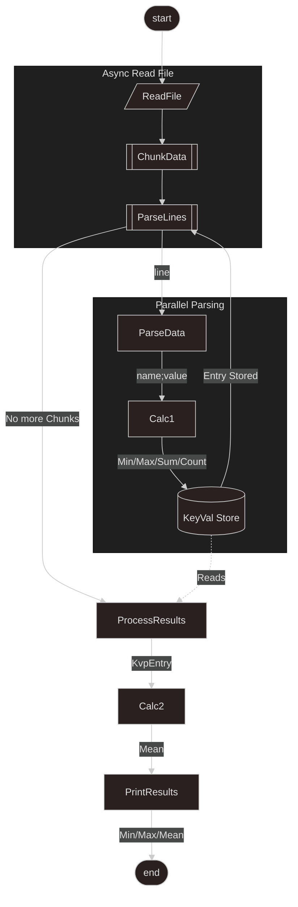

# Diagram
App level flow 

```mermaid
---
config:
    theme: 'neo-dark'
---
flowchart TB
    Start([start])
    End([end])

    Start --> ReadFile[/ReadFile/]
    subgraph AsyncFile [Async Read File]
        ReadFile --> ChunkData[[ChunkData]]
        ChunkData --> ParseLines[[ParseLines]]
    end

    subgraph ParserWorkers [Parallel Parsing]
        ParseLines --line--> ParseData
        ParseData --name;value--> Calc1
        Calc1 --Min/Max/Sum/Count--> KvStore[(KeyVal Store)]
        KvStore --Entry Stored--> ParseLines
    end

    ParseLines --No more Chunks--> ProcessResults
    ProcessResults --KvpEntry--> Calc2
    KvStore -.Reads.-> ProcessResults
    Calc2 --Mean--> PrintResults
    PrintResults --Min/Max/Mean--> End
```